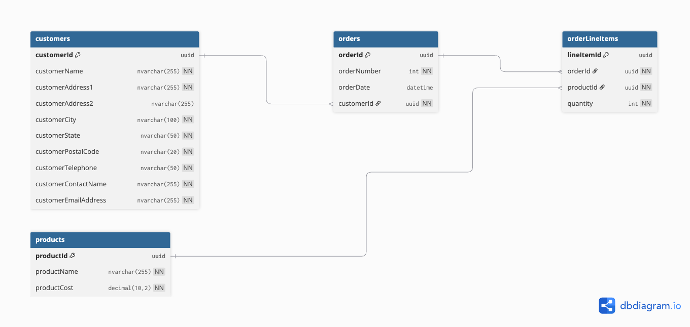

# Ace Invoice System

A Node.js REST API and Azure SQL backend for managing invoices, customers, and products. This project allows creating and retrieving orders, customers, and products via authenticated endpoints.

## Features

- Create new orders (invoices) with multiple line items
- Retrieve all orders (summary) and detailed order information
- List all customers and products
- Header-based API key authentication for protected endpoints
- Graceful error handling: 400, 401, 404, 500

## Prerequisites

- Node.js 18+
- npm or yarn
- Azure SQL Server
- Postman (optional, for testing)

## Database Setup

This project uses **Azure SQL Database**.

### 1. Create a new database

1. Go to the [Azure Portal](https://portal.azure.com).
2. Sign in with your database credentials.
3. Search for **Azure SQL server**.
4. Click **Create** if you do not have a database yet and give the database a name (e.g., `AceInvoice`).

### 2. Open Query Editor in Azure SQL

1. Navigate to your database → **Query editor (preview)**.
2. Sign in with your database credentials.

### 3. Run the SQL scripts

1. Open the `database/init.sql` file in your project.
2. Copy all the contents and paste them into the Query Editor.
3. Click **Run** to execute.  
   This will create all tables, constraints, and seed data.

### 4. Verify that tables and columns exist

Run the following query to list all tables:
```sql
SELECT TABLE_NAME 
FROM INFORMATION_SCHEMA.TABLES
WHERE TABLE_TYPE = 'BASE TABLE';
```

To check for columns in a specific table, for example **customers** run:
```sql
SELECT COLUMN_NAME, DATA_TYPE
FROM INFORMATION_SCHEMA.COLUMNS
WHERE TABLE_NAME = 'customers';
```
## Local Setup & Running the API
### 1. Clone the repository
```
git clone https://github.com/erickhrd/ace-invoice.git
cd ace-invoice
```
### 2. Install dependencies
```
npm install
```
### 3. Confugure environment variables
Create a .env file in the root of the project with the following content:
```
DB_USER=your_db_user
DB_PASS=your_db_password
DB_NAME=your_db_name
DB_HOST=your_db_server.database.windows.net
API_KEY=your_custom_api_key
```
### 4. Start the API
At this point you can start the API with the command:
```
npm start
```
### 5. Test the API
You can test the public endpoint on browser:
```
http://localhost:3000/api/public/hello
```
On command-line you can test a protected endpoint using:
```
curl -H "x-api-key: your_custom_api_key" http://localhost:3000/api/customer/viewall
```
Or you can test it using Postman by adding the **x-api-key** and value inside the **Headers** tab with a **GET** request in this case.

### 6. Test POST request
If Postman was installed you can test the POST request by entering this endpoint:
```
http://localhost:3000/api/order/new
```
And adding the **x-api-key** and value inside the **Headers** tab as well as **Content-Type** with **application/json** value. Here's an example that can be inserted in the body of the request:
```
{
  "invoiceData": {
    "customerId": "29B1115C-368D-4821-8429-C27F4AD285E0"
  },
  "products": [
    {
      "productId": "A9A875E0-97DD-4431-840E-BAE05985A976",
      "quantity": 4
    },
    {
      "productId": "44692190-B1CB-4980-A3D9-2B24AEB3D2CA",
      "quantity": 2
    }
  ]
}
```

## Assumptions & Design Decisions

### Database Design
- Customers, products, orders, and line items are stored in **separate tables** to follow normalization rules and avoid data duplication.
- **Primary keys** use `UNIQUEIDENTIFIER` (UUID) to allow scalability and prevent sequential ID conflicts.
- Product costs are stored as `DECIMAL(10,2)` to ensure at least two decimal places for currency values.




### API Design
- Follows **REST principles**:
  - `GET` endpoints for reading data
  - `POST` endpoints for creating orders
- Exposes `/api/public/hello` as a **health check** endpoint that does not require authentication.
- All other sensitive endpoints require a **header-based API key** (`x-api-key`) for simple authentication.
- JSON responses use **camelCase** to match the example responses provided in the assessment instructions.

### Error Handling
- Implemented the following status codes:
  - `400` – invalid input data
  - `401` – missing or invalid API key
  - `404` – resource not found
  - `500` – unexpected server errors
- All database operations are wrapped in **try/catch** blocks. Order creation uses an explicit database **transaction** (BEGIN → COMMIT → ROLLBACK) to ensure atomicity, meaning an order and its line items are either fully created together or fully rolled back if any step fails.

### Order & Invoice Handling
- Orders automatically get the **current date/time** as the invoice date using `GETDATE()` in SQL, instead of relying on client input.
- Each new order generates a **unique order ID** which corresponds to a new invoice number when viewing all orders.  
  This design decision was based on the **example JSON responses**, which indicated that creating a new order should increment the invoice number and include line items associated with that order.
- Line items include a **total cost** field (`quantity * productCost`) for easier front-end display and calculation.

### Development Decisions
- Chose **Node.js + Express** for flexibility and fast setup.
- **Environment variables (`.env`)** are used for database credentials and the API key to allow deployment on different machines without hardcoding sensitive data.
- Project organized with separate folders:
  - `database/` – SQL scripts
  - `src/` – API source code

### Reflection
Overall, this project was a great exercise to **polish my skills** in database design, REST API development, and integrating SQL with Node.js. It helped reinforce best practices for error handling, transactions, and designing APIs that match example responses.

